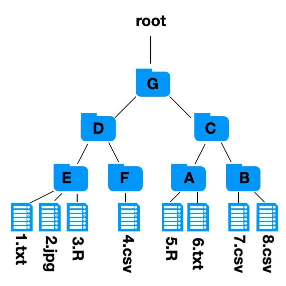

### Collaboration team: 

Record who you've worked on the assignment with here. 

## Assignment 1.2 -- Interacting with Filesystems

Write a brief answer explaining the following questions:

### Question 1

*What purposes does a filesystem serve?*

Your answer here.

### Question 2

*What is a file path? What is the difference between an absolute and relative file path?*

Your answer here.

### Question 3

*What is a working directory? Why do computers need to use working directories?*

Your answer here.

### Question 4

*The following is a diagram of folders on my computer. My working directory is in the folder labeled "F". I want to access the file "8.csv". (Remember ".." will move you up to a parent directory.)*

  a. *What is the absolute file path I must use?*

  Your answer here.

  b. *What is the relative  file path I must use?*
  
  Your answer here.

